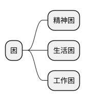

# 困

##  精神困
今天是上班的第二天，昨天一晚上才睡了5个小时，调整了上班模式，一下子又不适应。现在整个人都好疲倦。白天又睡不着。我现在整个人是**精神好困！**

## 工作困

在这上班已经五年了，从一个小高点掉下来，现在很多时候很无力。我此刻能够理解“人情薄凉”。早就想找人调出去了。但是事实上是找不到关系很难。并且家里孩子还小，确实需要我多在家里陪伴，如果去上行政班，我怕家里一地鸡毛！所以，**好困！**

## 生活困

老Y调走了，走的团圆计划，折腾了两年终于回去了。我高兴是因为他既然能够调回去，我也有希望。难受的是天下没有不散的宴席！真的好想回家上班！所以，这方面我也**很困！**

## 努力

昨天晚上上班的时候，忽然又想起我的考证和学英语计划。其实，我一直想努力改变，总是懒惰成性。确实需要做个todolist了！

> 英语兔音标的视频
<https://www.bilibili.com/video/BV1iV411z7Nj/?spm_id_from=333.337.search-card.all.click>

